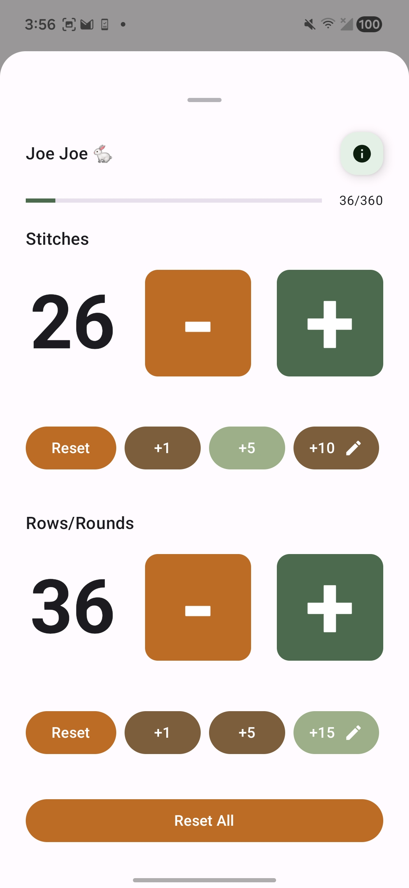
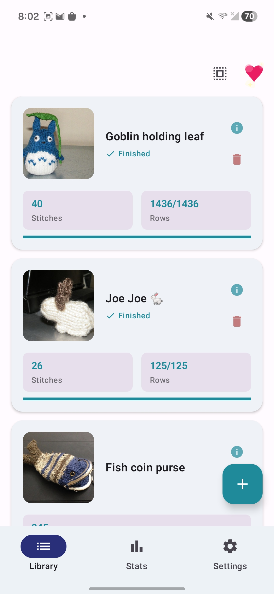
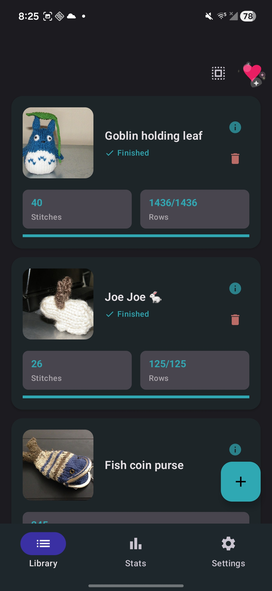
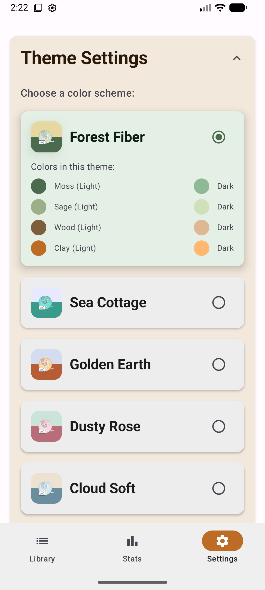
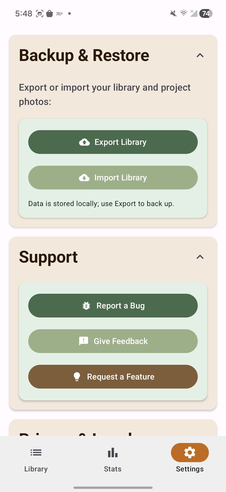

# Stitch Counter (Android)

A modern Android app for counting stitches and rows, with multiple themes, a project library, photos per project, and offline backup/restore. This repo is a rewrite of the older [Stitch Counter](https://github.com/annaharri89/stitchCounter) project.

## Screenshots

| | |
| --- | --- |
| Counter |  |
| Project library (light) |  |
| Project library (dark) |  |
| Theme settings |  |
| Backup & restore |  |

## Tech stack

| Area | Choices |
| --- | --- |
| Language | Kotlin |
| UI | Jetpack Compose, Material 3 |
| Min / compile / target SDK | 24 / 36 / 36 |
| DI | Hilt |
| Navigation | Compose Destinations, Navigation-Compose |
| Local data | Room (SQLite), DataStore Preferences |
| Images | Coil; JPEG compress + max dimension in `ImageStorageUtils` |
| Serialization | Kotlinx Serialization (backup/metadata) |
| Tooling | KSP, Compose compiler plugin, AGP 8.9.x, Kotlin 2.0.x (see `gradle/libs.versions.toml`) |

## Requirements & how to run

- **Android Studio** Koala Feature Drop 2024.1.2 or newer (or another environment with **JDK 17** and Android SDK **36** / build-tools compatible with `compileSdk 36`).
- Clone the repo, open the **project root** in Android Studio, let Gradle sync finish, then run the **`app`** configuration on a device or emulator (**API 24+**).

**Command line (debug build):**

```bash
./gradlew :app:assembleDebug
```

**Unit tests (same task CI uses for JVM tests):**

```bash
./gradlew :app:testDebugUnitTest
```

Release signing is optional for local exploration; see **Release: Signed Play Store AAB** below if you are cutting a store build.

## Project layout (high level)

Kotlin sources live under `app/src/main/java/dev/harrisonsoftware/stitchCounter/`.

```
stitchCounter/
├── feature/           # UI: library, single/double counter, project detail, settings, stats, support, navigation shell
├── data/              # Room (`ProjectDao`, entities, migrations), backup zip pipeline, repository implementations
├── domain/            # Models, validation, import/export use cases
├── di/                # Hilt modules (database, backup, etc.)
├── ui/theme/          # Material 3 theme, typography, colors
├── logging/           # File + logcat sinks, retention, bug-report packaging
├── MainActivity.kt
└── StitchCounterApp.kt
```

**Data flow (short):** UI in `feature/*` talks to ViewModels; persistence goes through repositories into Room; import/export and zip backup go through `data/backup` and domain use cases. Theme and launcher icon updates are coordinated from `feature/theme`.

## Features

- Single and double counter project modes for stitches and/or rows
- Library of saved projects with Room
- Six customizable Material 3 color themes plus light/dark; theme choice persists in DataStore and can update the launcher icon
- Responsive Compose layouts for phones and tablets, portrait and landscape
- Up to **6** photos per project: compressed JPEGs live in app-internal storage (`project_images`); Room stores relative paths; Coil loads from those files
- Backup and restore export a **zip** containing `backup.json` (project metadata and image path entries) **plus copies of each JPEG** under an `images/` tree—import extracts the zip, writes photos back into internal storage, and loads the library—offline device migration with no cloud account
- No in-app analytics; personal data stays on device (see in-app privacy policy URL in `Constants.kt`)

## Engineering guardrails

- CI runs `:app:testDebugUnitTest`.
- Install local Git hooks:

  ```bash
  bash scripts/install-git-hooks.sh
  ```

- The pre-commit hook runs `:app:testDebugUnitTest` when staged changes touch Kotlin under `app/src/main/`, `app/src/test/`, or `app/src/androidTest/` (JVM unit tests only; instrumentation tests are not run in the hook).

## Release: Signed Play Store AAB

This project is configured to build signed release AABs with an upload key from `keystore.properties`.

1. Create `keystore.properties` in the project root:
   - `storeFile=/absolute/path/to/upload-keystore.jks`
   - `storePassword=YOUR_STORE_PASSWORD`
   - `keyAlias=upload`
   - `keyPassword=YOUR_KEY_PASSWORD`
2. Build the signed AAB:
   - Android Studio Gradle task: `:app:buildPlayReleaseAab`
   - CLI equivalent: `./gradlew :app:buildPlayReleaseAab`

Notes:

- `buildPlayReleaseAab` runs release unit tests before packaging by way of the `bundleRelease` task dependency chain.
- On success, it logs the bundle output folder and tries to open it with the JVM `Desktop` API when a graphical desktop is available; on WSL, headless CI, or unsupported setups it only prints the path, which is enough to locate the AAB.
- AAB output path: `app/build/outputs/bundle/release/app-release.aab`.

### Release automation (GitHub Actions)

Workflow: [`.github/workflows/play-internal-cd.yml`](.github/workflows/play-internal-cd.yml).

- **Push to `main`:** When the [**CI**](.github/workflows/ci.yml) workflow completes successfully for a **`push`** to **`main`** (not pull requests), **Play internal CD** checks out that exact commit, runs [`scripts/bump-version-properties.sh`](scripts/bump-version-properties.sh) (increments `VERSION_CODE` and updates `VERSION_NAME` so every Play upload has a new `versionCode`), builds `./gradlew :app:bundleRelease`, uploads `app-release.aab` to the Play **internal** track, then commits `gradle/version.properties` and pushes to `main` with **`[skip ci]`** so that commit does not start another CI/CD cycle.
- **Manual:** GitHub → Actions → **Play internal CD** → **Run workflow** — same bump, build, upload, and version commit (use when you want an internal drop without waiting on the push rule above).

**Branch protection:** If the version-bump push is rejected, allow **GitHub Actions** to update `main` (for example a ruleset bypass for the default `GITHUB_TOKEN`), or use a fine-scoped personal access token stored as a secret and wire the checkout/push steps to use it.

**Secrets (repository):** These are the **secret names** GitHub Actions expects (see the workflow file); only the **values** live in GitHub Secrets—never commit keystores or passwords.

- `PLAY_SERVICE_ACCOUNT_JSON` — Google Play Developer API service account JSON (invited in Play Console for this app).
- `RELEASE_KEYSTORE_BASE64` — Base64 of the same upload keystore `.jks` you use locally.
- `RELEASE_KEYSTORE_PASSWORD` — Keystore `storePassword` (matches `keystore.properties`).
- `RELEASE_KEY_PASSWORD` — Signing `keyPassword` (matches `keystore.properties`).
- `RELEASE_KEY_ALIAS` — Signing `keyAlias` (matches `keystore.properties`).
